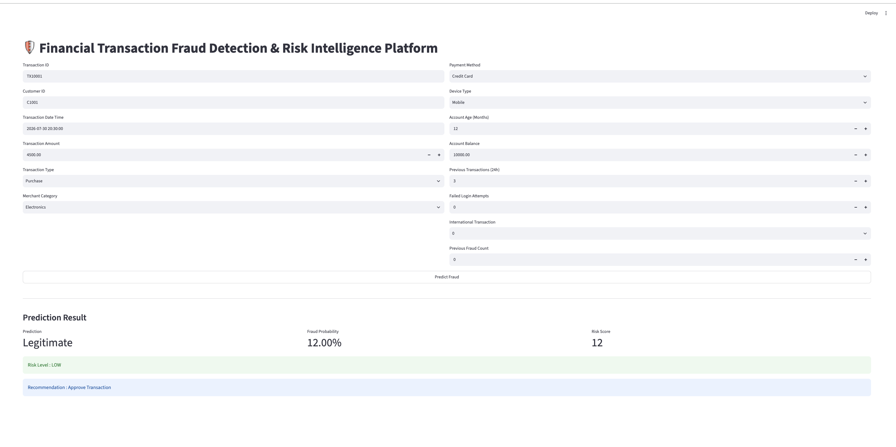
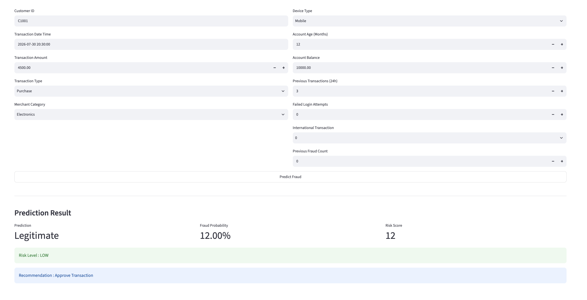

# 🛡️ Financial Transaction Fraud Detection & Risk Intelligence Platform

A production-inspired Machine Learning application that detects fraudulent financial transactions, assigns risk scores, and provides business recommendations through an interactive Streamlit dashboard.

---

## 🚀 Overview

Financial fraud causes billions of dollars in losses every year. This project predicts whether a transaction is fraudulent using supervised machine learning and translates model predictions into actionable business decisions using a Risk Intelligence Engine.

Instead of returning only **Fraud** or **Not Fraud**, the system provides:

- Fraud Probability
- Risk Score (0–100)
- Risk Level (Low / Medium / High)
- Business Recommendation

---

## ✨ Features

- Data Validation & Exploratory Data Analysis
- Fraud-specific Feature Engineering
- Automated Preprocessing Pipeline
- Multiple Model Comparison
- Model Evaluation
- Risk Scoring Engine
- Single Transaction Prediction
- Batch Prediction
- Model Persistence using Joblib
- Interactive Streamlit Dashboard

---

## 🛠️ Tech Stack

- Python
- Pandas
- NumPy
- Scikit-learn
- Matplotlib
- Streamlit
- Joblib

---

## 📂 Project Structure

```text
financial-transaction-fraud-detection-risk-intelligence-platform/

├── data/
├── models/
├── outputs/
├── src/
│   ├── data/
│   ├── features/
│   ├── preprocessing/
│   ├── models/
│   ├── risk/
│   ├── services/
│   └── utils/
│
├── app.py
├── main.py
└── README.md
```

---

## ⚙️ Machine Learning Workflow

```text
Raw Dataset
      │
      ▼
Data Validation
      │
      ▼
Feature Engineering
      │
      ▼
Preprocessing Pipeline
      │
      ▼
Model Training
      │
      ▼
Model Evaluation
      │
      ▼
Fraud Prediction
      │
      ▼
Risk Scoring
      │
      ▼
Business Recommendation
```

---

## 📊 Dashboard

### Dashboard Overview

> Add dashboard screenshot here



### Prediction Example

> Add prediction screenshot here



## 📈 Model Evaluation

The project evaluates models using:

- Accuracy
- Precision
- Recall
- F1 Score
- ROC-AUC
- Confusion Matrix
- Classification Report

---

## 🧠 Risk Intelligence Engine

The model probability is transformed into business-friendly outputs.

| Risk Score | Level | Recommendation |
|------------:|-------|----------------|
| 0–29 | Low | Approve Transaction |
| 30–69 | Medium | Manual Review |
| 70–100 | High | Block Transaction |

---

## 🚀 Running the Project

Clone the repository

```bash
git clone https://github.com/YOUR_USERNAME/Financial-Transaction-Fraud-Detection-Risk-Intelligence-Platform.git
```

Install dependencies

```bash
pip install -r requirements.txt
```

Train the model

```bash
python main.py
```

Run the Streamlit dashboard

```bash
streamlit run app.py
```

---

## 📌 Future Improvements

- XGBoost
- LightGBM
- Hyperparameter Tuning
- Cross Validation
- SHAP Explainability
- Drift Detection
- Docker Deployment
- REST API
- Cloud Deployment

---

## 👨‍💻 Author

**Rahul Dehariya**

GitHub: https://github.com/rahulDehariya

Portfolio: https://rahuldehariya.github.io/rahul-portfolio/